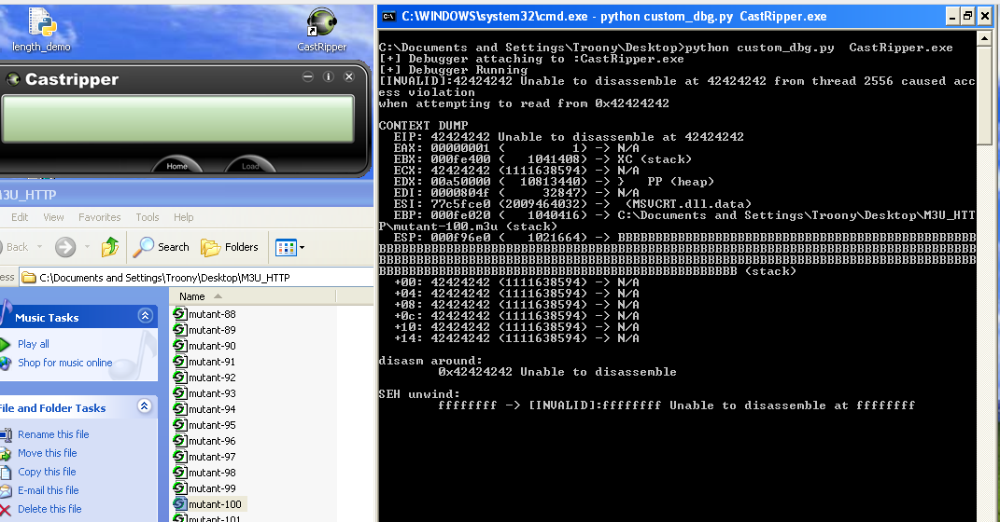

# pydebug

A lightweight Python Debugger powered by PyDbg and Paimei

## How to use it

- Execute the debugee
- Run pydebug with the debugee as an argument

`python pydebug debugee.exe`

## Sample Output

